<div align="center">


<h1>Policy-as-Code Library Platform</h1>

<p><strong>The Strategic Governance Repository for Reusable, Modular, and Versioned Enterprise Policies.</strong></p>

[]()
[]()
[]()

<br/>

> **"Code is Law."** 
> **Policy-as-Code Library** is an enterprise-grade governance system designed to unify security, compliance, and operational rules into a single source of truth. It enables automated enforcement across infrastructure (Terraform), runtime (Kubernetes), and delivery (CI/CD) pipelines.

</div>

---

## 🏛️ Executive Summary

Traditional governance often relies on static PDF documents and manual audits, leading to inconsistent enforcement, security gaps, and "Compliance Theatre." Organizations often fail to secure their environments because policy requirements are disconnected from the actual engineering workflows, creating significant friction and regulatory risk.

This platform provides the **Governance Control Plane**. It implements a complete **Policy-as-Code Lifecycle Framework**, enabling Security and Compliance teams to manage institutional guardrails as a first-class citizen. By automating the evaluation of resources against versioned libraries and orchestrating real-time admission control, we ensure that every organizational asset is compliant by default, audited for history, and resilient against policy drift.

---

## 📐 Architecture Storytelling: Principal Reference Models

### 1. Principal Architecture: Global Policy-as-Code Governance & Enforcement Plane
This diagram illustrates the end-to-end flow from policy authoring and testing to multi-engine distribution, CI/CD gating, runtime enforcement, and institutional auditing.

```mermaid
graph LR
    %% Subgraph Definitions
    subgraph PolicyDesign["Policy Design & Authoring"]
        direction TB
        Author["Policy Authoring IDE"]
        Tests["Unit & Integration Tests"]
        Version["Semantic Versioning (Git)"]
    end

    subgraph IntelligenceEngine["Governance Intelligence Hub"]
        direction TB
        API["FastAPI Policy Gateway"]
        Translator["Multi-Engine Translator (OPA/Sentinel)"]
        Simulator["Policy Impact Simulator (Dry-Run)"]
        Registry["Central Policy Registry"]
    end

    subgraph EnforcementPlane["Enforcement & Gating Hub"]
        direction TB
        CICD["CI/CD Pipeline Gate"]
        AdmCtrl["K8s Admission Controller"]
        CloudScan["Real-time Cloud Scanner"]
    end

    subgraph OperationsHub["Institutional Compliance Hub"]
        direction TB
        Scorecard["Compliance Posture Scorecard"]
        Violation["Violation Remediation Hub"]
        Audit["Forensic Policy Lake"]
    end

    subgraph DevOps["Governance-as-Code Orchestration"]
        direction TB
        TF["Terraform Policy Modules"]
        OPA["OPA Policy Agent (WASM/Binary)"]
        Baseline["Dynamic Security Baselines"]
    end

    %% Flow Arrows
    PolicyDesign -->|1. Register Policy| API
    API -->|2. Translate Logic| Translator
    Translator -->|3. Simulate Impact| Simulator
    Simulator -->|4. Publish Bundle| Registry
    
    Registry -->|5. Enforce Gate| CICD
    Registry -->|6. Validate Admission| AdmCtrl
    Registry -->|7. Audit State| CloudScan
    
    API -->|8. Visualize Health| Scorecard
    Scorecard -->|9. Manage Violations| Violation
    Scorecard -->|10. Gather Evidence| Audit
    
    TF -->|11. Provision Hub| IntelligenceEngine
    OPA -->|12. Execute Local| CICD
    Baseline -->|13. Map to Controls| Registry

    %% Styling
    classDef design fill:#f5f5f5,stroke:#616161,stroke-width:2px;
    classDef intel fill:#e0f2f1,stroke:#004d40,stroke-width:2px;
    classDef enforcement fill:#e1f5fe,stroke:#01579b,stroke-width:2px;
    classDef ops fill:#f3e5f5,stroke:#4a148c,stroke-width:2px;
    classDef devops fill:#fffde7,stroke:#f57f17,stroke-width:2px;

    class PolicyDesign design;
    class IntelligenceEngine intel;
    class EnforcementPlane enforcement;
    class OperationsHub ops;
    class DevOps devops;
```

### 2. The Policy Lifecycle Management Flow
The continuous path of a policy from initial authoring and testing to versioned distribution, multi-mode enforcement, and forensic auditing.

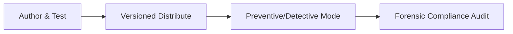

### 3. CI/CD Policy Gate Orchestration
Shifting security left by integrating automated policy checks into the software delivery pipeline to block non-compliant infrastructure and application changes.

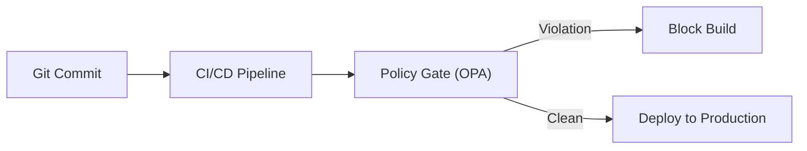

### 4. Multi-Engine Policy Translation Hub
Bridging multiple policy frameworks (OPA Rego, HashiCorp Sentinel, Cloud Custodian) into a unified management plane for enterprise-wide governance.

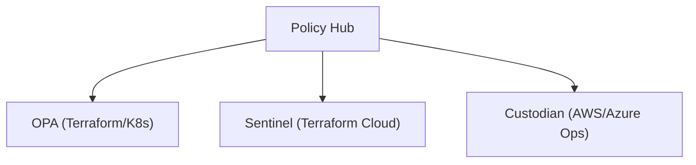

### 5. Policy-as-Code vs. Traditional GRC Flow
Evolution from manual, document-heavy audits to automated, continuous verification that provides real-time compliance attestation.

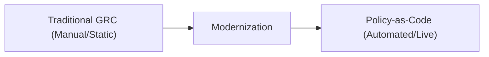

### 6. Real-time Admission Control & Enforcement
Validating resources at the point of creation within Kubernetes or Cloud environments to ensure that only compliant assets are provisioned.

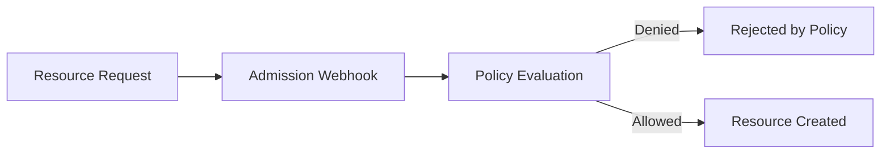

### 7. Institutional Compliance Scorecard
Grading organizational performance based on key indicators: Regulatory Adherence (NIST/CIS), Violation Density, and Remediation Velocity.

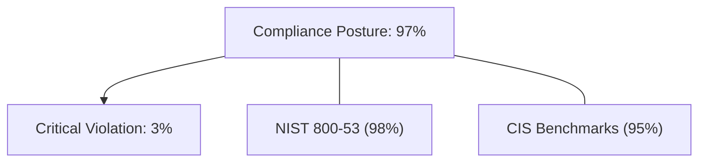

### 8. Identity & RBAC for Policy Ops
Managing fine-grained access to policy authoring, enforcement settings, and violation data between authors and security auditors.

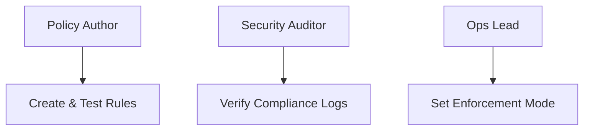

### 9. Policy Impact Assessment (PIA) Flow
Evaluating the potential impact of new or modified policies against historical resource data (Dry-Run) to prevent production friction.

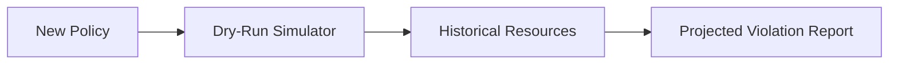

### 10. IaC Deployment: Governance-as-Code Framework
Using Terraform to deploy and manage the versioned distribution of the policy engine, registry, and admission control infrastructure.

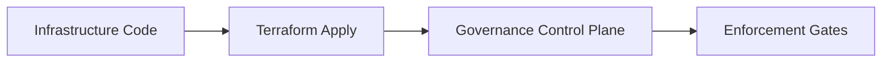

### 11. Metadata Lake for Forensic Policy Audit
Storing long-term records of every policy evaluation, decision reason, and violation event for institutional investigation and audit.

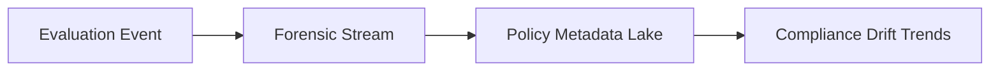

---

## 🏛️ Core Governance Pillars

1.  **Modular Policy Authoring**: Creating reusable policy fragments that can be composed into domain-specific guardrails.
2.  **Multi-Framework Mapping**: Automatically tagging policies with CIS, NIST, and ISO controls for simplified compliance.
3.  **Continuous Enforcement**: Integrating policy checks into CI/CD and GitOps workflows to catch violations early.
4.  **Preventive & Detective Modes**: Offering both blocking (preventive) and alerting (detective) enforcement options.
5.  **Policy Testing Hub**: Ensuring policy accuracy through unit tests and impact simulations before distribution.
6.  **Full Auditability**: Immutable recording of every evaluation and policy version for institutional record-keeping.

---

## 🛠️ Technical Stack & Implementation

### Policy Engine & APIs
*   **Framework**: Python 3.11+ / FastAPI.
*   **Evaluation Engine**: Multi-mode engine for JSON/YAML rule processing with support for WASM-based OPA bundles.
*   **Translator Hub**: Logic for mapping regulatory frameworks (NIST, CIS) to specific technical policy rules.
*   **Admission Hub**: Real-time webhook integration for Kubernetes and cloud-native resource validation.
*   **State Management**: PostgreSQL (Metadata Lake) and Redis (Policy Cache).

### Policy Dashboard (UI)
*   **Framework**: React 18 / Vite.
*   **Theme**: Dark, Slate, Emerald (Enterprise governance aesthetic).
*   **Visualization**: Recharts for compliance trajectory, framework coverage, and violation heatmaps.

### Infrastructure & DevOps
*   **Runtime**: AWS EKS or Azure Kubernetes Service (AKS).
*   **IaC**: Modular Terraform for deploying the governance hub and enforcement gate distributions.

---

## 🏗️ IaC Mapping (Module Structure)

| Module | Purpose | Real Services |
| :--- | :--- | :--- |
| **`infrastructure/gov_hub`** | Central management plane | EKS, PostgreSQL, Redis |
| **`infrastructure/gates`** | CI/CD and Admission gates | Lambda, Gatekeeper, OPA |
| **`infrastructure/scanners`** | Real-time drift detectors | AWS Config, Azure Policy |
| **`infrastructure/auditing`** | Forensic governance sinks | S3, Athena, Quicksight |

---

## 🚀 Deployment Guide

### Local Principal Environment
```bash
# Clone the policy platform
git clone https://github.com/devopstrio/policy-as-code-library.git
cd policy-as-code-library

# Configure environment
cp .env.example .env

# Launch the Governance stack
make up

# Run a mock policy evaluation simulation
make evaluate-mock
```

Access the Policy Dashboard at `http://localhost:3000`.

---

## 📜 License
Distributed under the MIT License. See `LICENSE` for more information.

---
<div align="center">
  <p>© 2026 Devopstrio. All rights reserved.</p>
</div>
