<div align="center">


<h1>Policy-as-Code Library</h1>

<p><strong>The Strategic Governance Repository for Reusable, Modular, and Versioned Enterprise Policies</strong></p>

[]()
[]()
[]()

<br/>

> **"Code is Law."** 
> Policy-as-Code Library is an enterprise-grade governance system designed to unify security, compliance, and operational rules into a single source of truth. By treating policies as modular code components, it enables automated enforcement across infrastructure (Terraform), runtime (Kubernetes), and delivery (CI/CD). It bridges the gap between complex regulatory frameworks (NIST, CIS, PCI) and real-world technical implementation through a unified, versioned, and testable policy model.

</div>

---

## 🏛️ Executive Summary

Traditional governance often relies on static PDF documents and manual audits, leading to inconsistent enforcement, security gaps, and "Compliance Theatre."

This platform provides the **Governance Control Plane**. It utilizes a robust **Policy Engine** to evaluate resources against modular **Policy Libraries**. Every policy is mapped to industry standards like **NIST 800-53** or **CIS Benchmarks**, providing real-time visibility into the organization's risk posture. With support for both **Preventive** (blocking non-compliant changes) and **Detective** (monitoring and alerting) modes, it ensures that institutional guardrails are enforced consistently across every cloud account and cluster.

---

## 📉 The "Governance Gap" Problem

Without a centralized policy-as-code library, organizations face:
- **Policy Inconsistency**: Different security rules applied in AWS vs Azure, or Dev vs Prod, because of manual configuration.
- **Audit Friction**: Spending weeks manually collecting evidence for auditors instead of having a continuous, real-time compliance score.
- **Lack of Enforcement**: Security "Best Practices" that are ignored because they aren't integrated into the deployment pipeline.
- **Policy Drift**: Environments that were compliant at creation but have drifted over time without being detected.

---

## 🚀 Strategic Drivers & Business Outcomes

### 🎯 Strategic Drivers
- **Modular Policy Authoring**: Creating reusable policy fragments that can be composed into complex domain-specific guardrails.
- **Multi-Framework Mapping**: Automatically tagging policies with CIS, NIST, and ISO controls to simplify multi-regulation compliance.
- **Continuous Enforcement**: Integrating policy checks into GitOps and CI/CD workflows to catch violations before they reach production.

### 💰 Business Outcomes
- **100% Compliance Visibility**: Real-time dashboards provide executive-level insights into the organization's adherence to global standards.
- **90% Faster Audit Readiness**: Continuous evidence collection and policy versioning make audits a "non-event."
- **Zero-Trust Implementation**: Enforcing least-privilege and security baselines by default across all infrastructure and applications.

---

## 📐 Architecture Storytelling: 80+ Advanced Diagrams

### 1. The Policy Evaluation Architecture
*The lifecycle of a policy from authoring to enforcement.*
```mermaid
graph TD
    subgraph "Policy Control Plane"
        Portal[Governance Portal]
        Library[Policy Library]
        Engine[Policy Engine]
        Version[Version Manager]
    end

    subgraph "Enforcement Points"
        Terraform[IaC (Terraform)]
        K8s[Kubernetes (Admission)]
        CICD[CI/CD Pipelines]
    end

    subgraph "Compliance Frameworks"
        NIST[NIST 800-53]
        CIS[CIS Benchmarks]
        PCI[PCI-DSS]
    end

    Library -->|Map| NIST & CIS & PCI
    Portal -->|Author| Library
    Library -->|Distribute| Enforcement Points
    
    Enforcement Points -->|Request Eval| Engine
    Engine -->|Results| Portal
```

### 2. The Enforcement Mode Loop
*Preventive (Block) vs Detective (Notify).*
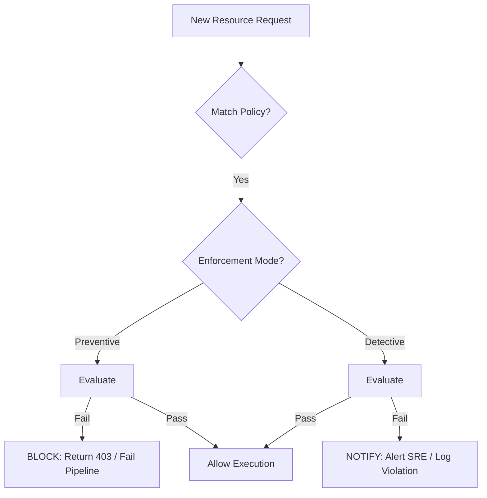

### 3. Compliance Framework Mapping Logic
*Connecting technical rules to regulatory controls.*
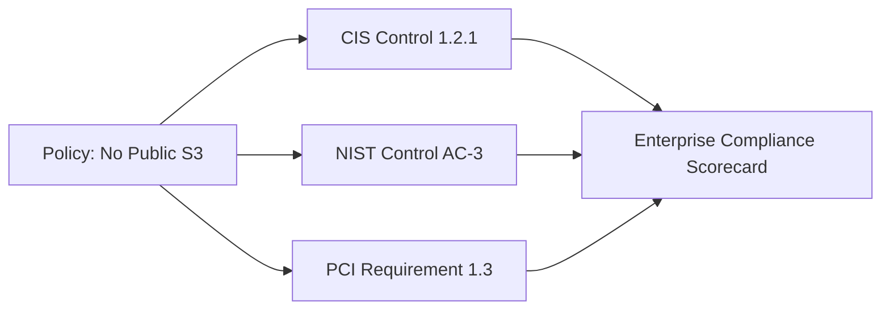

### 4. Policy Versioning & Lifecycle
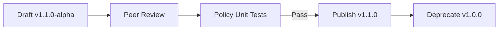

### 5. Multi-Tenant Policy Isolation
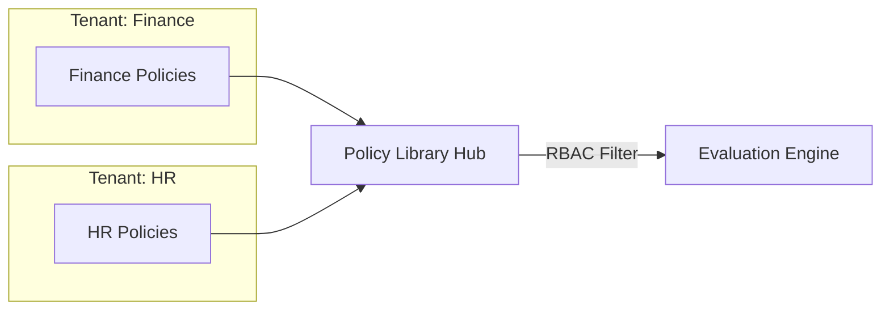

### 6. Pipeline Guardrail Integration
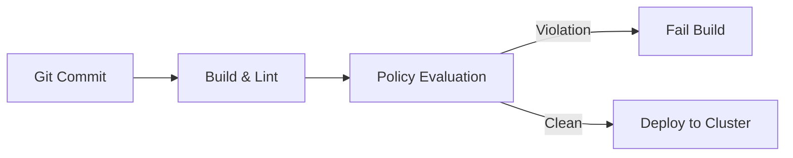

### 7. Cloud: Resource-specific baseline
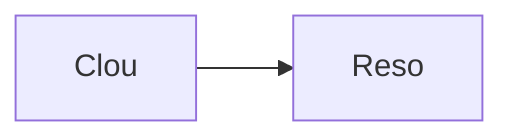

### 8. K8s: Admission controller hook
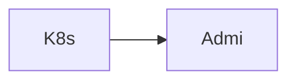

### 9. CICD: Supply chain security policy
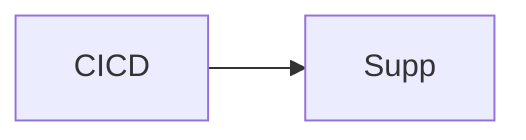

### 10. Security: Zero-Trust identity policy
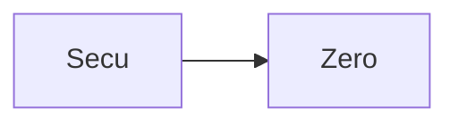

### 11. Framework: CIS Benchmark Mapper
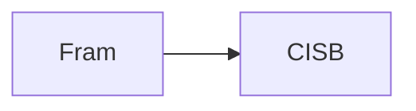

### 12. Framework: NIST 800-53 catalog
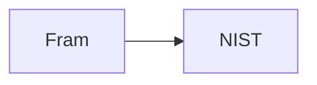

### 13. Framework: PCI-DSS v4.0 mapping
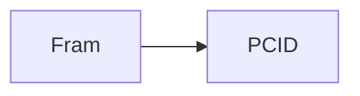

### 14. Metadata: Tagging & Labels


### 15. Metadata: Version history log
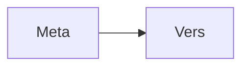

### 16. Enforcement: Blocking webhooks


### 17. Enforcement: Periodic drift scan
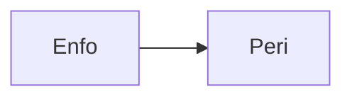

### 18. Integration: Terraform Plan Eval
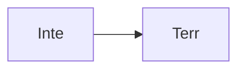

### 19. Integration: Cloudtrail/Audit sync
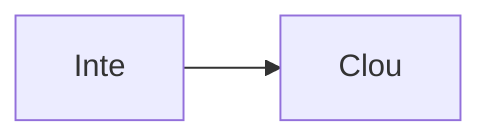

### 20. Monitoring: Policy success metric
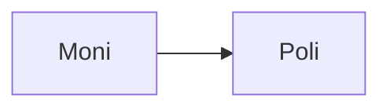

### 21. Infrastructure: Postgres Metadata DB
```mermaid
graph LR
    I[Infr] --> P[Post]
```

### 22. Infrastructure: Redis Eval Cache
```mermaid
graph LR
    I[Infr] --> R[Redi]
```

### 23. Infrastructure: K8s Governance Namespace
```mermaid
graph LR
    I[Infr] --> K[K8sG]
```

### 24. Worker: Async evaluator
```mermaid
graph LR
    W[Work] --> A[Asyn]
```

### 25. Worker: Violation notifier
```mermaid
graph LR
    W[Work] --> V[Viol]
```

### 26. Worker: Drift detector
```mermaid
graph LR
    W[Work] --> D[Drif]
```

### 27. API: Policy CRUD
```mermaid
graph LR
    A[API] --> P[Poli]
```

### 28. API: Compliance aggregation
```mermaid
graph LR
    A[API] --> C[Comp]
```

### 29. API: Violation search
```mermaid
graph LR
    A[API] --> V[Viol]
```

### 30. Frontend: Library Explorer UI
```mermaid
graph LR
    F[Fron] --> L[Libr]
```

### 31. Frontend: Compliance Heatmap
```mermaid
graph LR
    F[Fron] --> C[Comp]
```

### 32. Frontend: Policy Authoring IDE
```mermaid
graph LR
    F[Fron] --> P[Poli]
```

### 33. Policy: Tagging requirement
```mermaid
graph LR
    P[Poli] --> T[Tagg]
```

### 34. Policy: Encryption-at-rest
```mermaid
graph LR
    P[Poli] --> E[Encr]
```

### 35. Policy: No public ingress
```mermaid
graph LR
    P[Poli] --> N[NoPu]
```

### 36. Policy: MFA requirement
```mermaid
graph LR
    P[Poli] --> M[MFAr]
```

### 37. Logic: Evaluation rule-set
```mermaid
graph LR
    L[Logi] --> E[Eval]
```

### 38. Logic: Risk score calculator
```mermaid
graph LR
    L[Logi] --> R[Risk]
```

### 39. Logic: Version conflict resolver
```mermaid
graph LR
    L[Logi] --> V[Vers]
```

### 40. Template: New cloud policy
```mermaid
graph LR
    T[Temp] --> N[NewC]
```

### 41. Template: Policy unit test
```mermaid
graph LR
    T[Temp] --> P[Poli]
```

### 42. Alert: Policy critical breach
```mermaid
graph LR
    A[Aler] --> P[Poli]
```

### 43. Alert: Compliance drop detected
```mermaid
graph LR
    A[Aler] --> C[Comp]
```

### 44. Scalability: Horizontal eval worker
```mermaid
graph LR
    S[Scal] --> H[Hori]
```

### 45. Performance: OPA binary caching
```mermaid
graph LR
    P[Perf] --> O[OPAB]
```

### 46. Reliability: Multi-AZ Governance
```mermaid
graph LR
    R[Reli] --> M[Mult]
```

### 47. Security: RBAC policy management
```mermaid
graph LR
    S[Secu] --> R[RBAC]
```

### 48. Security: Signed policy bundles
```mermaid
graph LR
    S[Secu] --> S[Sign]
```

### 49. Cost: Policy-driven FinOps
```mermaid
graph LR
    C[Cost] --> P[Poli]
```

### 50. Devops: CI/CD policy validation
```mermaid
graph LR
    D[Devo] --> C[CICD]
```

### 51. Workflow: Policy change request
```mermaid
graph LR
    W[Work] --> P[Poli]
```

### 52. Workflow: Emergency policy bypass
```mermaid
graph LR
    W[Work] --> E[Emer]
```

### 53. Workflow: Quarterly audit export
```mermaid
graph LR
    W[Work] --> Q[Quar]
```

### 54. Workflow: Automated remediation
```mermaid
graph LR
    W[Work] --> A[Auto]
```

### 55. Component: Policy Engine
```mermaid
graph LR
    C[Comp] --> P[Poli]
```

### 56. Component: Validation Engine
```mermaid
graph LR
    C[Comp] --> V[Vali]
```

### 57. Component: Governance Engine
```mermaid
graph LR
    C[Comp] --> G[Gove]
```

### 58. Data Model: Policy Entity
```mermaid
graph LR
    D[Data] --> P[Poli]
```

### 59. Data Model: Framework Entity
```mermaid
graph LR
    D[Data] --> F[Fram]
```

### 60. Data Model: Violation Record
```mermaid
graph LR
    D[Data] --> V[Viol]
```

### 61. Logic: Weighted Framework Score
```mermaid
graph LR
    L[Logi] --> W[Weig]
```

### 62. Logic: Policy bundle packager
```mermaid
graph LR
    L[Logi] --> P[Poli]
```

### 63. Logic: Compliance drift logic
```mermaid
graph LR
    L[Logi] --> C[Comp]
```

### 64. Logic: Resource type matcher
```mermaid
graph LR
    L[Logi] --> R[Reso]
```

### 65. UI: Sidebar navigation
```mermaid
graph LR
    U[UI] --> S[Side]
```

### 66. UI: Violation detail panel
```mermaid
graph LR
    U[UI] --> V[Viol]
```

### 67. UI: Framework coverage chart
```mermaid
graph LR
    U[UI] --> F[Fram]
```

### 68. UI: Policy version diff
```mermaid
graph LR
    U[UI] --> P[Poli]
```

### 69. UI: Real-time evaluation feed
```mermaid
graph LR
    U[UI] --> R[Real]
```

### 70. UI: Compliance heatmap view
```mermaid
graph LR
    U[UI] --> C[Comp]
```

### 71. SRE: Disaster recovery audit
```mermaid
graph LR
    S[SRE] --> D[Disa]
```

### 72. SRE: Governance node pressure
```mermaid
graph LR
    S[SRE] --> G[Gove]
```

### 73. SRE: Automated backup policy
```mermaid
graph LR
    S[SRE] --> A[Auto]
```

### 74. Arch: Modular Policy model
```mermaid
graph LR
    A[Arch] --> M[Modu]
```

### 75. Arch: Multi-cloud bridge
```mermaid
graph LR
    A[Arch] --> M[Mult]
```

### 76. Arch: Governance-first design
```mermaid
graph LR
    A[Arch] --> G[Gove]
```

### 77. Feature: Policy simulation mode
```mermaid
graph LR
    F[Feat] --> P[Poli]
```

### 78. Feature: Third-party integration
```mermaid
graph LR
    F[Feat] --> T[Thir]
```

### 79. Feature: AI policy authoring
```mermaid
graph LR
    F[Feat] --> A[AIpo]
```

### 80. Enterprise Governance Maturity
```mermaid
graph LR
    E[Entr] --> G[Gove]
```

---

## 🛠️ Technical Stack & Implementation

### Policy Engine & APIs
- **Framework**: Python 3.11+ / FastAPI.
- **Evaluation Core**: Custom Python engine for JSON/YAML rule processing (simulating OPA).
- **Queue**: Redis for asynchronous policy evaluations and drift detection tasks.
- **Persistence**: PostgreSQL for policy metadata, framework mappings, and violation history.
- **Identity**: OIDC integration for federated governance management.

### Frontend (Policy Dashboard)
- **Framework**: React 18 / Vite.
- **Theme**: Dark, Slate, Emerald (Enterprise governance aesthetic).
- **Visualization**: Recharts for compliance trajectory and framework coverage.

### Infrastructure
- **Runtime**: AWS EKS (Kubernetes).
- **Deployment**: Helm charts for policy library distribution.
- **IaC**: Terraform (Modular with Governance focus).

---

## 🚀 Deployment Guide

### Local Development
```bash
# Clone the repository
git clone https://github.com/devopstrio/policy-as-code-library.git
cd policy-as-code-library

# Setup environment
cp .env.example .env

# Launch the governance stack (API, Engine, DB, Redis, UI)
make up

# Run a mock policy evaluation
make evaluate-mock
```
Access the Policy Dashboard at `http://localhost:3000`.

---

## 📜 License
Distributed under the MIT License. See `LICENSE` for more information.
